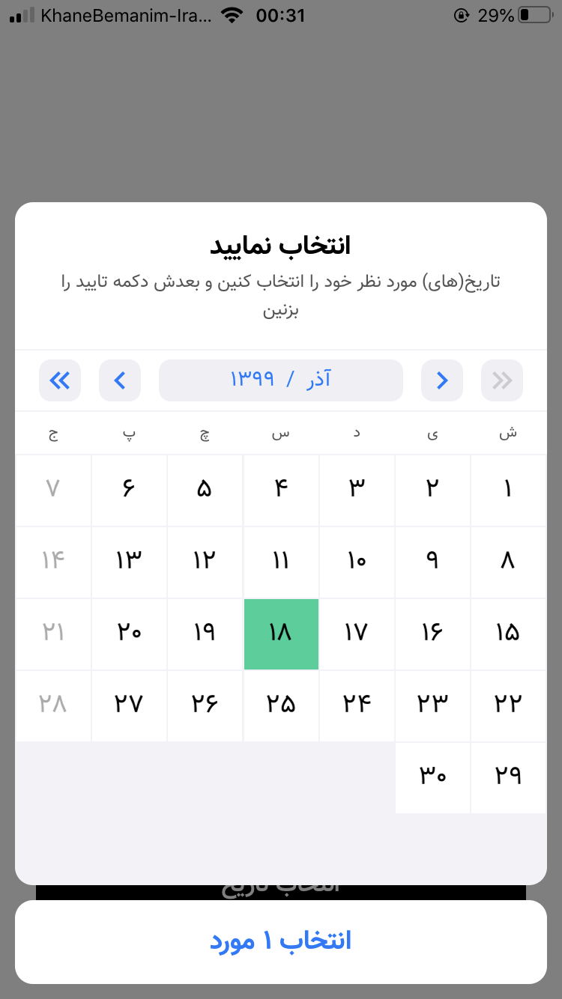
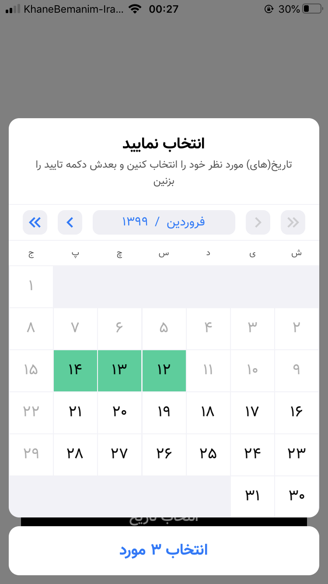
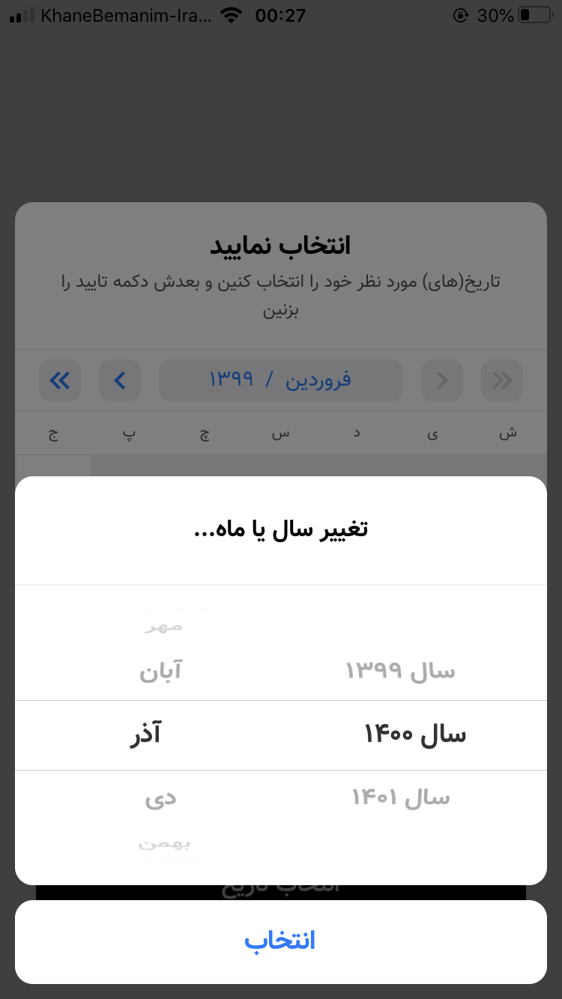

<p dir='rtl'>سلام دوستان! 🤓</p>

<div dir='rtl'>
  <h1>🗓 🇮🇷 انتخاب‌گر تاریخ پارسی</h1>
  <p>
  خود آی‌او‌اس یه DatePicker داره که میشه Locale و Calendar رو براش به بطوری تنظیم کرد تا باهاش بتونیم یه تاریخ پارسی انتخاب کنیم. اما شخصا بنظرم زیاد جالب نبود؛ چون با استفاده از اون:

  <ul>
    <li>هربار فقط میشه <b>یک</b> تاریخ رو انتخاب کرد.</li>
    <li>از فونت پیشفرض خود سیستم عامل استفاده می‌کنه.</li>
    <li>خوشگل نیست.</li>
  </ul>

  </p>

  <p>
  برای همین تصمیم گرفتم یه چیزی پیاده‌سازی کنم تا این ویژگی‌ها/ایرادات رو نداشته باشه. چندتا عکس هم ازش قرار دادم، تا بتونین یه نگاهی (قبل از استفاده) بهش بندازین.
  </p>

  <table>
    <tr>
      <td></td>
      <td></td>
      <td></td>
    </tr>
  </table>

  <h1>نصب</h1>
  <p>
  برای نصب می‌تونین از <code>Cocoapod</code> استفاده کنین. عبارت مورد استفاده برای نصب هم اینه:

  <pre dir='ltr'>pod 'IDPersianDatePicker'</pre>

  </p>

  <p>👈 توجه داشته باشین که زبان مورد استفاده توی این پروژه <span style='font-weight: bold; color: orange;'>سوییفت نسخه ۴.۲</span> بوده. </p>

  <h1>استفاده</h1>

  <h2>قدم اول</h2>
  <p>اولین قدم اینه که ایمپورتش کنین: </p>
  <div dir='ltr'>
  
```swift
import IDPersianDatePicker
```

  </div>

  <h2>قدم دوم</h2>
  <p>مرحله بعد اینه که ویوکنترلر شما یه پروتکل رو پیاده‌سازی کنه. پروتکلی که باید پیاده‌سازی کنه <code>PersianDatePickerDelegate</code> هست. وظیفه این پروتکل آماده کردن داده‌ها و مشخصه‌های مورد استفاده در انتخاب‌گر هست.<br>
  متدها و مشخصه‌هایی که داره بصورت زیر هست:

  <ul>
    <li>مشخصه <code>persianDatePicker_BaseFont</code> از نوع <code dir='ltr' style='color: #3498DB;'>UIFont</code>
    <p>این مشخصه فونت مورد استفاده توی انتخاب‌گر رو مشخص می‌کنه.</p><br>
    </li>
    <li>مشخصه <code>persianDatePicker_Title</code> از نوع <code dir='ltr' style='color: #3498DB;'>String</code>
    <p>این مشخصه عنوان مورد نظر برای انتخاب‌گر رو مشخص می‌کنه.</p><br>
    </li>
    <li>مشخصه <code>persianDatePicker_Message</code> از نوع <code dir='ltr' style='color: #3498DB;'>String?</code>
    <p>این مشخصه پیام دلخواه شما (که زیر عنوان قرار می‌گیره) رو مشخص می‌کنه؛ و البته اجباری نیست.</p><br>
    </li>
    <li>مشخصه <code>persianDatePicker_SelectedDateColors</code> از نوع <code dir='ltr' style='color: #3498DB;'>(text: UIColor, background: UIColor)</code>
    <p>این مشخصه رنگ مورد نظر شما برای روزهای انتخاب‌شده رو مشخص می‌کنه. در واقع اولی رنگ متن و دومی رنگ پس‌زمینه رو مشخص می‌کنه.</p><br>
    </li>
    <li>مشخصه <code>persianDatePicker_CanSelectMultipleDates</code> از نوع <code dir='ltr' style='color: #3498DB;'>Bool</code>
    <p> با استفاده از این مشخصه می‌تونین فعال‌بودن قابلیت انتخاب چندین روز رو مشخص کنین.</p><br>
    </li>
    <li>مشخصه <code>persianDatePicker_MinimumDate</code> از نوع <code dir='ltr' style='color: #3498DB;'>Date</code>
    <p>این مشخصه حداقل روز قابل انتخاب رو مشخص می‌کنه.</p><br>
    </li>
    <li>مشخصه <code>persianDatePicker_MaximumDate</code> از نوع <code dir='ltr' style='color: #3498DB;'>Date</code>
    <p>این مشخصه حداکثر روز قابل انتخاب رو مشخص می‌کنه.</p><br>
    </li>
    <li>متد <code dir='ltr'>persianDatePicker_CanSelectDate(_ date: Date)</code> و خروجی از نوع <code dir='ltr' style='color: #3498DB;'>Bool</code>
    <p>با استفاده از این متد می‌تونین از انتخاب یه سری روزها جلوگیری کنین.</p><br>
    </li>
    <li>متد <code dir='ltr'>persianDatePicker_DidSelectDates(_ dates: [Date])</code>
    <p>زمانیکه که کاربر روی دکمه انتخاب بزنه، روزهایی که انتخاب شده، با استفاده از این متد در دسترس خواهند بود.</p><br>
    </li>
  </ul>
  </p>

  <p>👈 اینو در نظر داشته باشین که همه این مشخصه‌ها و متدها اجباری نیستن؛ بعضیاشون دارای بنده پیشفرض هستن که می‌تونین خودتون بررسی‌شون کنین.
  </p>


  <h2>قدم سوم</h2>
  <p>
  برای فراخوانی و نمایش انتخاب‌گر هم بصورت زیر عمل می‌کنیم:
  </p>

  <div dir='ltr'>

```swift
PersianDatePickerController.Present(
  from       : UIViewController,
  delegate   : PersianDatePickerDelegate,
  completion : (() -> Void)?
)
```

  </div>
  
  <p>
  توی این متد، پارامتر <code>from</code> مشخص‌کننده ویوکنترلر فعلی هست، پارامتر <code>delegate</code> برابر اون آبجکتی هست که پروتکل مورد نیاز رو پیاده‌سازی کرده، و اون پارامتر <code>completion</code> هم که بعد از نمایش انتخاب‌گر فراخوانی میشه.
  </p>

  <h2>سخن آخر</h2>
  <p>
    <ul>
      <li>👀
      اگه ایرادی توی روند پیاده‌سازی یا استفاده مشاهده کردین، حتما بگین تا رفعش کنیم. 
      </li>
      <li>🤝
      اگه قابلیت خاصی به ذهن‌تون رسید که می‌تونست به بهتر شدن این پروژه کمک کنه، حتمن بگین؛ شاید با کمک هدیگه پیاده‌سازی‌اش کردیم.
      </li>
      <li>😋
      تنکیوووووو. 
      </li>
    </ul>
  </p>

</div>


<p></p>


